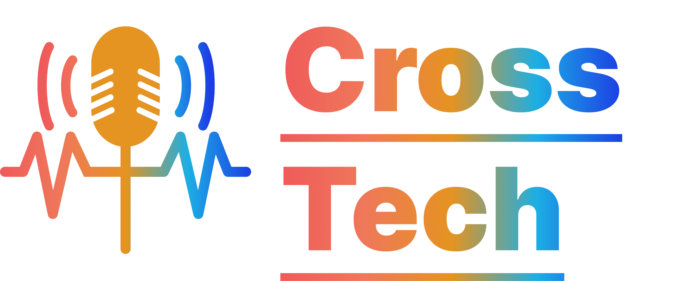

# Alpar Academy HTML e CSS

Desafios de HTML e CSS, da 2ª edição do Programa Rocket, da empresa [Alpar](https://alpar.com.br/).

## Desafios HTML

### HTML - Desafio 1 

Faça uma página que servirá como o seu portifólio, conte sobre você, e use uma foto sua,
use as tags aprendidas.

Ao longo do curso, conecte as outras páginas criadas como parte do seu portifólio nessa
sua página principal.

Não se preocupe com a beleza, trabalharemos isso ao longo do curso. Pense apenas nos
dados que serão exibidos, e na estrutura em HTML.

Envie para o GitHub, e ative o GitHub Pages.

[Acessar Site](https://gedo23.github.io/AlparAcademy-Portifolio/)

---

### HTML - Desafio 2

Faça um menu de uma cafeteria, invente um nome e um logo e os pratos servidos.

Você deve utilizar 3 listas (ordenadas ou não ordenadas, a escolha é sua), as listas devem
conter títulos, e devem ser: Bebidas, Salgados e Doces.

Utilize sublistas para listar os ingredientes principais dos pratos (não precisa ter todos,
pode ser um aviso para alérgicos).

Conecte essa atividade ao seu portifólio utilizando a tag `A`.

Não se preocupe com a beleza, trabalharemos isso ao longo do curso. Pense apenas nos
dados que serão exibidos, e na estrutura em HTML.

Envie para o GitHub junto com o seu portifólio.

[Acessar Site](https://gedo23.github.io/AlparAcademy-Portifolio/cafeteria/)

---

### HTML - Desafio 3

**1º Desafio:**

Na página da cafeteria, do desafio anterior, acrescente uma tabela com os horários de
funcionamento, copiando da tabela abaixo:

<table>
    <thead>
         <tr>
            <th>Horarios</th>
            <th>Segunda</th>
            <th>Terça</th>
            <th>Quarta</th>
            <th>Quinta</th>
            <th>Sexta</th>
            <th>Sábado</th>
            <th>Domingos e Feriados</th>
        </tr>
    </thead>
    <tbody>
        <tr>
            <td><strong>Manhã</strong></td>
            <td>08:00 12:00</td>
            <td rowspan="2">Fechado</td>
            <td>08:00 12:00</td>
            <td>08:00 12:00</td>
            <td>08:00 12:00</td>
            <td>08:00 12:00</td>
            <td rowspan="2">08:00 12:00</td>
        </tr>
        <tr>
            <td><strong>Tarde</strong></td>
            <td>14:00 18:00</td>
            <td>14:00 18:00</td>
            <td>14:00 18:00</td>
            <td>14:00 18:00</td>
            <td>14:00 18:00</td>
        </tr>
    </tbody>
</table>

Suba para o github.

[Acessar Site](https://gedo23.github.io/AlparAcademy-Portifolio/cafeteria/)

---

**2° Desafio:**

Crie uma página de um site de uma empresa, real ou fictícia, utilizando tabelas para definir
o layout.

Não aplique o layout em tabelas nos outros sites já feitos, tenha paciência!
Conecte com o seu portifólio e suba para o github.

[Acessar Site](https://gedo23.github.io/AlparAcademy-Portifolio/alpar-table/)

---

### HTML - Desafio 4

Crie uma página de formulário para contato para o café, que inclua os seguintes campos:
- Nome Completo
- Email
- Telefone
- Assunto
- Mensagem

Utilize as tags aprendidas para criar este formulário e certifique-se de que todos os
campos, exceto o telefone, são obrigatórios.

Depois de criar a página, conecte-a com o seu portfólio e suba para o GitHub.

[Acessar Site](https://gedo23.github.io/AlparAcademy-Portifolio/cafeteria/fale-conosco.html)

---

### HTML - Desafio 5

Faça o seu próprio Podcast!

Utilizando as tags aprendidas, faça site e coloque um vídeo de pelo menos um minuto para
apresentar o seu podcast e os assuntos abordados nele.

Grave 2 áudios de pelo menos um minuto cada e os coloque nesse site.

O podcast pode ser sobre o assunto que mais te interessar!

Não se preocupe com a aparência ainda.

Depois de criar a página, conecte-a com o seu portfólio e suba para o GitHub.

**Equipe de desenvolvimento:**
- João Victor Ferreira Faustino Fortes
- Gabriel Eringer de Oliveira

[Acessar Site](https://gedo23.github.io/AlparAcademy-Portifolio/crosstech-podcast/)

## Desafios CSS

### CSS - Desafio 1

Organizem os documentos HTML de vocês:

Agora vocês deverão organizar o conteúdo de vocês em pastas dessa forma:
- ``index.html`` -> seu portifólio
- ``assets/`` -> pasta com o css, imagens e fontes (se tiver) do seu portifólio
- ``cafeteria/``
  - ``index.html`` -> site da cafeteria, com a tabela de funcionamento e contato incluso
- ``assets/`` -> pasta com o css, imagens e fontes (se tiver) da cafeteria
- ``seusite-table/`` -> o nome do seu site de tabela (adicione “-table” ao final)
  - ``index.html`` -> o seu site de tabela
  - ``assets/`` -> pasta com o css, imagens e fontes (se tiver) do seu site em tabela
- ``podcast/`` -> o nome do seu podcast
  - ``index.html`` -> o seu podcast
  - ``assets/`` -> pasta com o css, imagens e fontes (se tiver) do seu podcast
- ``blog/`` -> aqui ficará o site que será desenvolvido durante o curso!
  - ``index.html`` -> lembre-se que todo site começa com o index.html
  - ``assets/`` -> pasta com o css, imagens e fontes

Aplique o CSS aprendido, corrija erros e TESTE o seu site.

DEIXE TUDO EM MINUSCULO! SEM ESPAÇOS OU ACENTUAÇÕES!!

---

### CSS - Desafio 02

Crie uma página HTML com um cartão de perfil básico utilizando apenas HTML e CSS.

Seu cartão deve conter:
- Uma foto sua com a borda redonda
- Seu nome
- Uma pequena descrição sobre você
- Um link para o seu linkedin e github
- Links da sua preferencia
- Tenha como exemplo o [linktree](https://linktr.ee/)

Adicione esse desafio em uma nova pasta chamada "card".

[Acessar Site](https://gedo23.github.io/AlparAcademy-Portifolio/card/)

---

### CSS - Desafio 03

Recrie o seu site em tabela, mas agora sem usar tabelas! Não se importe com posicionamento dos elementos, trabalharemos isso em breve, mas apliquem estilos.
- O site deve ter um NAVBAR, que deve ficar fixo no topo do site e seguir o scroll.
- O site deve ter tanto conteúdo (mesmo que lorem ipsum ou gerado por IA), que apareça um scroll.

[Acessar Site](https://gedo23.github.io/AlparAcademy-Portifolio/alpar-table/)

### CSS - Desafio 04

Aplique FLEXBOX no seu site sem tabela desenvolvido no desafio anterior, e organize os conteúdos.

Você também pode usar o FLEXBOX nas suas outras páginas!